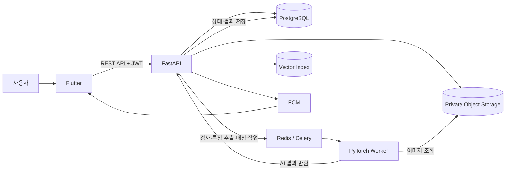
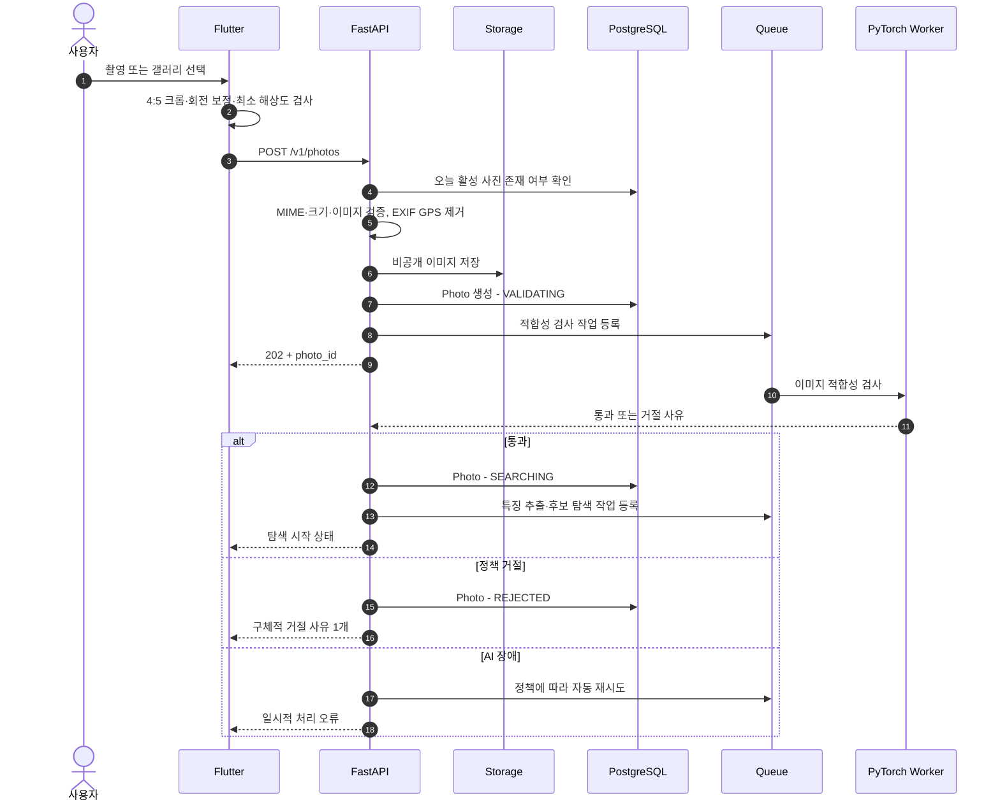
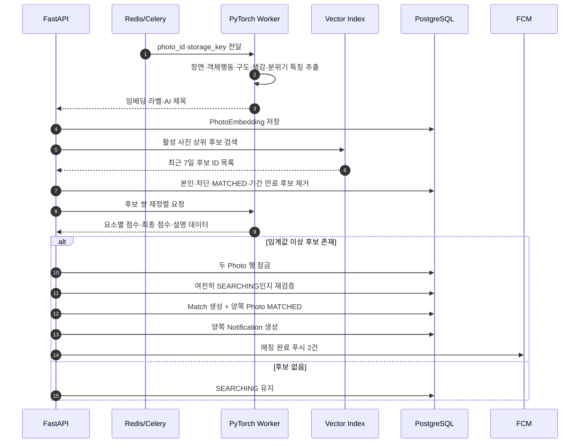
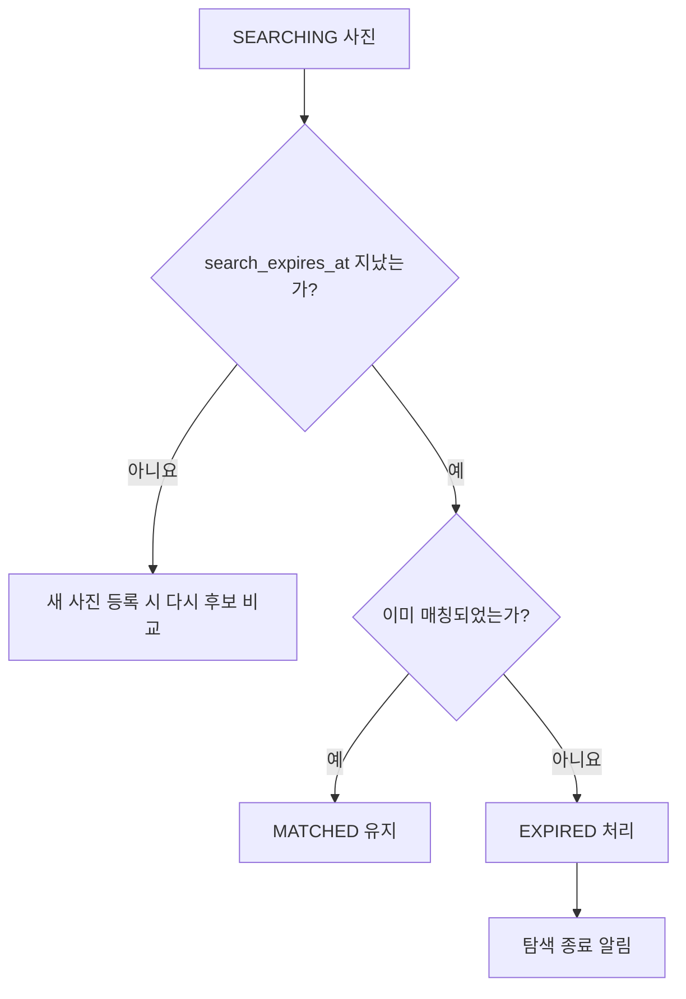
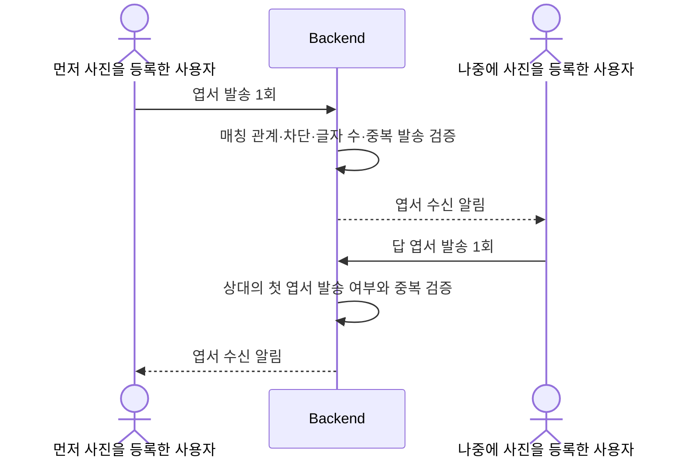

# 01. 서비스 구조 및 전체 워크플로우

## 1. 핵심 사용자 흐름

```text
오늘의 사진 촬영 또는 선택
→ 4:5 비율 편집
→ AI 사진 적합성 검사
→ 최대 7일간 닮은 사진 탐색
→ 평행한 순간 발견
→ 두 사진과 매칭 이유 공개
→ 상대방에게 엽서 보내기
→ 순간과 엽서 보관
```

---

## 2. 전체 시스템 구조



> Flutter는 AI Worker, DB, Storage에 직접 접근하지 않는다. Backend가 인증·권한·상태·트랜잭션을 소유한다.

---

## 3. 파트별 책임

| 파트 | 담당 |
|---|---|
| Flutter | 온보딩, 카카오 로그인 UI, 권한 요청, 촬영·선택, 4:5 크롭, 업로드, 상태·결과·엽서 화면, 푸시 처리 |
| Backend | 카카오 토큰 검증, JWT, 사진 저장, 일일 제한, 작업 큐, 상태 전이, 후보 필터링, 매칭 트랜잭션, 엽서·신고·차단·알림 |
| AI | 적합성 검사, 특징 추출, 임베딩, 후보 재정렬 점수, 매칭 설명 데이터 생성, 모델 버전 관리 |
| PostgreSQL | 계정, 사진 메타데이터, AI 결과, 매칭, 엽서, 알림, 차단, 신고 저장 |
| Object Storage | 4:5 원본과 썸네일 저장 |

---

## 4. 사진 등록부터 탐색 시작까지



---

## 5. AI 후보 탐색과 매칭 확정



> 🔒 매칭 직전에 두 사진을 다시 확인하고 잠가야 한다. 그래야 같은 사진이 동시에 여러 사진과 매칭되는 것을 방지할 수 있다.

---

## 6. 7일 탐색 종료



---

## 7. 엽서 흐름



> 기획 정책상 먼저 사진을 등록한 사용자가 먼저 엽서를 보낸 후, 나중 사용자가 답 엽서를 보낼 수 있다. 해당 정책은 UI와 서버가 동일하게 적용해야 한다.

