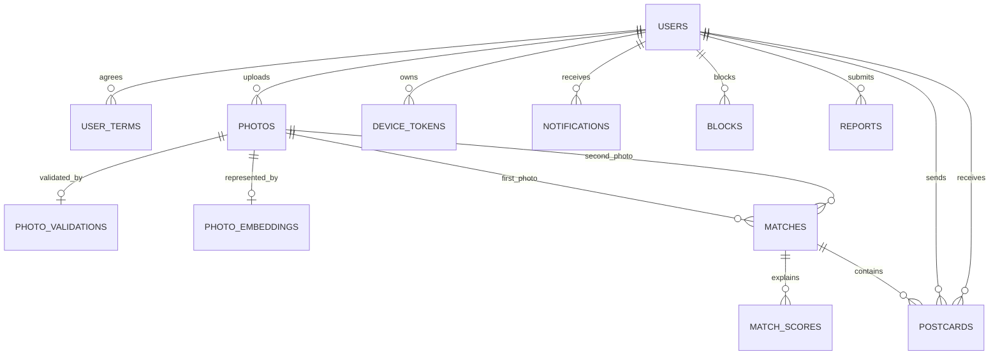
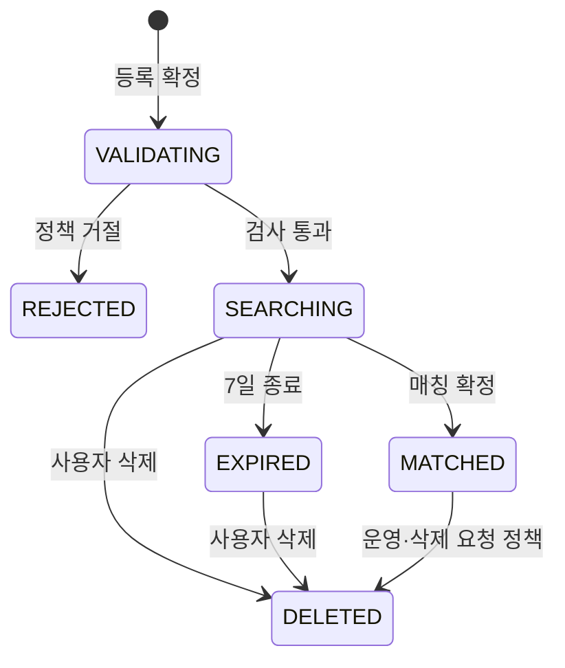

# 02. DB 스키마 및 ERD

## 1. DB 설계 원칙

- PK는 UUID, 날짜는 `TIMESTAMPTZ`, 내부 시간 기준은 UTC로 통일한다.
- 이미지 바이너리는 DB에 넣지 않고 비공개 Object Storage에 저장한다.
- DB에는 만료 URL이 아니라 `storage_key`를 저장한다.
- 위치정보는 저장하지 않으며 업로드 시 EXIF GPS를 제거한다.
- AI 결과마다 `model_name`, `model_version`을 기록한다.
- 매칭 결과는 재현 가능하도록 요소별 점수와 최종 점수를 저장한다.
- 사진당 한 번의 매칭과 매칭당 사용자별 한 번의 엽서를 DB 제약조건으로 보호한다.
- 사진 상태 변경과 매칭 생성은 트랜잭션으로 처리한다.

---

## 2. ERD



---

## 3. `users`

| 컬럼 | 타입 | Null | 제약조건 | 설명 |
|---|---|---:|---|---|
| `id` | UUID | N | PK | 사용자 ID |
| `kakao_id` | VARCHAR(100) | N | UNIQUE | 카카오 사용자 식별값 |
| `nickname` | VARCHAR(12) | Y | UNIQUE | 온보딩 전 NULL, 완료 후 2~12자 닉네임 |
| `profile_image_key` | VARCHAR(500) | Y |  | 프로필 이미지 키 |
| `bio` | VARCHAR(100) | Y |  | 한 줄 소개 |
| `status` | VARCHAR(20) | N | DEFAULT ACTIVE | ACTIVE, RESTRICTED, WITHDRAWN |
| `marketing_agreed` | BOOLEAN | N | DEFAULT FALSE | 마케팅 수신 동의 |
| `created_at` | TIMESTAMPTZ | N |  | 가입 시각 |
| `updated_at` | TIMESTAMPTZ | N |  | 수정 시각 |
| `withdrawn_at` | TIMESTAMPTZ | Y |  | 탈퇴 시각 |

---

## 4. `user_terms`

| 컬럼 | 타입 | Null | 제약조건 | 설명 |
|---|---|---:|---|---|
| `id` | UUID | N | PK | 동의 ID |
| `user_id` | UUID | N | FK → users.id | 사용자 |
| `term_type` | VARCHAR(30) | N |  | SERVICE, PRIVACY, AGE_14, MARKETING |
| `term_version` | VARCHAR(20) | N |  | 약관 버전 |
| `agreed` | BOOLEAN | N |  | 동의 여부 |
| `agreed_at` | TIMESTAMPTZ | N |  | 처리 시각 |

`UNIQUE (user_id, term_type, term_version)`

---

## 5. `photos`

| 컬럼 | 타입 | Null | 제약조건 | 설명 |
|---|---|---:|---|---|
| `id` | UUID | N | PK | 사진 ID |
| `user_id` | UUID | N | FK → users.id | 소유자 |
| `storage_key` | VARCHAR(500) | N | UNIQUE | 4:5 원본 저장 키 |
| `thumbnail_key` | VARCHAR(500) | Y |  | 썸네일 키 |
| `content_type` | VARCHAR(50) | N |  | 실제 MIME 타입 |
| `file_size` | BIGINT | N | CHECK > 0 | 파일 크기 |
| `width` | INTEGER | N | CHECK > 0 | 너비 |
| `height` | INTEGER | N | CHECK > 0 | 높이 |
| `checksum` | VARCHAR(64) | N |  | 중복 사진 검사값 |
| `status` | VARCHAR(20) | N |  | VALIDATING, REJECTED, SEARCHING, MATCHED, EXPIRED, DELETED |
| `ai_title` | VARCHAR(100) | Y |  | AI 생성 순간 제목 |
| `registered_date` | DATE | N |  | 사용자 기준 등록 일자 |
| `registered_at` | TIMESTAMPTZ | N |  | 등록 시각 |
| `search_expires_at` | TIMESTAMPTZ | Y |  | 탐색 종료 시각 |
| `deleted_at` | TIMESTAMPTZ | Y |  | 삭제 시각 |

### 하루 한 장 구현

`REJECTED`, `DELETED`는 일일 활성 사진 제한에서 제외한다.

```sql
CREATE UNIQUE INDEX photos_one_active_per_day_uq
ON photos (user_id, registered_date)
WHERE status IN ('VALIDATING', 'SEARCHING', 'MATCHED', 'EXPIRED');
```

### 주요 인덱스

```sql
INDEX (status, registered_at)
INDEX (status, search_expires_at)
INDEX (user_id, registered_at DESC)
INDEX (user_id, checksum)
```

> `registered_date`는 사용자 시간대 기준 날짜를 서버에서 계산해 저장한다. 서버 인스턴스의 로컬 날짜에 의존하지 않는다.

---

## 6. `photo_validations`

| 컬럼 | 타입 | Null | 제약조건 | 설명 |
|---|---|---:|---|---|
| `id` | UUID | N | PK | 검사 ID |
| `photo_id` | UUID | N | FK, UNIQUE | 사진 ID |
| `status` | VARCHAR(20) | N |  | PENDING, PROCESSING, PASSED, REJECTED, FAILED |
| `rejection_code` | VARCHAR(50) | Y |  | 대표 거절 사유 1개 |
| `scores` | JSONB | Y |  | 검사 항목별 내부 점수 |
| `model_name` | VARCHAR(100) | N |  | 검사 모델 |
| `model_version` | VARCHAR(50) | N |  | 모델 버전 |
| `attempt_count` | INTEGER | N | DEFAULT 0 | 시도 횟수 |
| `started_at` | TIMESTAMPTZ | Y |  | 시작 시각 |
| `completed_at` | TIMESTAMPTZ | Y |  | 종료 시각 |

### 거절 코드

```text
TOO_BLURRY
TOO_DARK
SCREENSHOT
TEXT_DOMINANT
QR_OR_BARCODE
SENSITIVE_INFORMATION
SEXUAL_OR_VIOLENT
ADVERTISEMENT
DUPLICATE_PHOTO
```

AI 장애는 `rejection_code`가 아니라 별도 시스템 오류로 처리한다.

---

## 7. `photo_embeddings`

| 컬럼 | 타입 | Null | 제약조건 | 설명 |
|---|---|---:|---|---|
| `id` | UUID | N | PK | 임베딩 ID |
| `photo_id` | UUID | N | FK, UNIQUE | 사진 ID |
| `scene_vector` | VECTOR | N |  | 장면 벡터 |
| `object_action_vector` | VECTOR | N |  | 객체·행동 벡터 |
| `composition_vector` | VECTOR | N |  | 구도 벡터 |
| `color_vector` | VECTOR | N |  | 색감·조명 벡터 |
| `mood_vector` | VECTOR | N |  | 분위기 벡터 |
| `labels` | JSONB | Y |  | 설명용 장면·객체 라벨 |
| `model_name` | VARCHAR(100) | N |  | 특징 추출 모델 |
| `model_version` | VARCHAR(50) | N |  | 모델 버전 |
| `created_at` | TIMESTAMPTZ | N |  | 생성 시각 |

> Vector 저장소를 별도로 사용할 경우 DB에는 외부 벡터 ID와 모델 버전을 저장한다. MVP에서는 PostgreSQL + pgvector 구성이 관리하기 쉽다.

---

## 8. `matches`

| 컬럼 | 타입 | Null | 제약조건 | 설명 |
|---|---|---:|---|---|
| `id` | UUID | N | PK | 매칭 ID |
| `photo_a_id` | UUID | N | FK → photos.id | 정렬된 첫 사진 ID |
| `photo_b_id` | UUID | N | FK → photos.id | 정렬된 둘째 사진 ID |
| `user_a_id` | UUID | N | FK → users.id | 첫 사용자 |
| `user_b_id` | UUID | N | FK → users.id | 둘째 사용자 |
| `final_score` | NUMERIC(6,5) | N | CHECK 0~1 | 최종 점수 |
| `explanation` | TEXT | N |  | 사용자 공개 설명 |
| `model_name` | VARCHAR(100) | N |  | 재정렬 모델 |
| `model_version` | VARCHAR(50) | N |  | 모델 버전 |
| `matched_at` | TIMESTAMPTZ | N |  | 확정 시각 |

### 필수 제약조건

```sql
CHECK (photo_a_id <> photo_b_id)
CHECK (user_a_id <> user_b_id)
CHECK (photo_a_id < photo_b_id)
UNIQUE (photo_a_id)
UNIQUE (photo_b_id)
UNIQUE (photo_a_id, photo_b_id)
```

> 실제 구현에서는 한 사진이 A열과 B열을 가로질러 중복될 가능성까지 차단해야 한다. 가장 안전한 방법은 `match_participants(match_id, photo_id, user_id)` 보조 테이블에 `UNIQUE(photo_id)`를 두는 것이다.

### 권장 보조 테이블 `match_participants`

| 컬럼 | 타입 | 제약조건 |
|---|---|---|
| `match_id` | UUID | PK, FK |
| `photo_id` | UUID | PK, FK, UNIQUE |
| `user_id` | UUID | FK |
| `role` | VARCHAR(10) | A 또는 B |

---

## 9. `match_scores`

| 컬럼 | 타입 | 설명 |
|---|---|---|
| `match_id` | UUID | PK, FK |
| `scene_score` | NUMERIC(6,5) | 장면 점수 |
| `object_action_score` | NUMERIC(6,5) | 객체·행동 점수 |
| `composition_score` | NUMERIC(6,5) | 구도 점수 |
| `color_score` | NUMERIC(6,5) | 색감·조명 점수 |
| `mood_score` | NUMERIC(6,5) | 분위기 점수 |
| `explanation_factors` | JSONB | 설명에 사용한 2~3개 요소 |

---

## 10. `postcards`

| 컬럼 | 타입 | Null | 제약조건 | 설명 |
|---|---|---:|---|---|
| `id` | UUID | N | PK | 엽서 ID |
| `match_id` | UUID | N | FK → matches.id | 매칭 |
| `sender_id` | UUID | N | FK → users.id | 송신자 |
| `receiver_id` | UUID | N | FK → users.id | 수신자 |
| `content` | VARCHAR(200) | N | CHECK | 1~200자, 공백만 불가 |
| `read_at` | TIMESTAMPTZ | Y |  | 읽은 시각 |
| `sent_at` | TIMESTAMPTZ | N |  | 발송 시각 |
| `sender_deleted_at` | TIMESTAMPTZ | Y |  | 보낸함에서 숨김 |
| `receiver_deleted_at` | TIMESTAMPTZ | Y |  | 받은함에서 숨김 |

```sql
UNIQUE (match_id, sender_id)
CHECK (sender_id <> receiver_id)
CHECK (length(trim(content)) BETWEEN 1 AND 200)
```

엽서는 발송 후 내용을 수정하거나 재발송하지 않는다.

---

## 11. `blocks`

| 컬럼 | 타입 | 제약조건 | 설명 |
|---|---|---|---|
| `blocker_id` | UUID | PK, FK | 차단한 사용자 |
| `blocked_id` | UUID | PK, FK | 차단된 사용자 |
| `created_at` | TIMESTAMPTZ |  | 차단 시각 |

```sql
PRIMARY KEY (blocker_id, blocked_id)
CHECK (blocker_id <> blocked_id)
```

차단 관계는 방향과 무관하게 매칭 후보에서 제외한다.

---

## 12. `reports`

| 컬럼 | 타입 | 설명 |
|---|---|---|
| `id` | UUID | 신고 ID |
| `reporter_id` | UUID | 신고자 |
| `target_type` | VARCHAR(20) | PHOTO, POSTCARD, USER |
| `target_id` | UUID | 대상 ID |
| `reason_code` | VARCHAR(50) | 신고 사유 |
| `detail` | TEXT | 기타 상세 |
| `status` | VARCHAR(20) | PENDING, REVIEWING, RESOLVED, REJECTED |
| `created_at` | TIMESTAMPTZ | 신고 시각 |
| `resolved_at` | TIMESTAMPTZ | 처리 시각 |

---

## 13. `notifications` / `device_tokens` / `notification_settings`

### `notifications`

| 핵심 컬럼 | 설명 |
|---|---|
| `user_id` | 수신자 |
| `type` | VALIDATION_PASSED, PHOTO_REJECTED, MATCHED, POSTCARD_RECEIVED, SEARCH_EXPIRED, SYSTEM |
| `target_type`, `target_id` | 이동할 화면 대상 |
| `payload` | 화면 표시용 데이터 |
| `read_at`, `deleted_at` | 읽음 및 사용자 삭제 |

### `device_tokens`

`user_id`, `token UNIQUE`, `platform`, `last_used_at`, `created_at`

### `notification_settings`

`user_id PK`, 검사 알림, 매칭 알림, 엽서 알림, 탐색 종료 알림, 운영 알림의 수신 여부를 저장한다.

---

## 14. 상태 전이



`DRAFT`는 Flutter 로컬 편집 상태로 관리하고, 서버에는 등록 확정 시 `VALIDATING`부터 저장하는 것을 권장한다.

