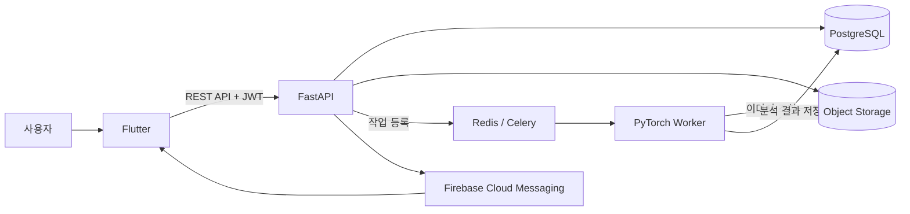
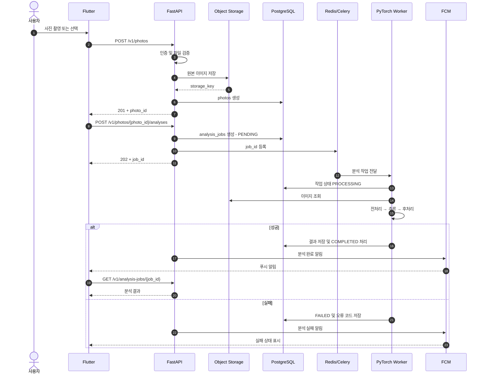
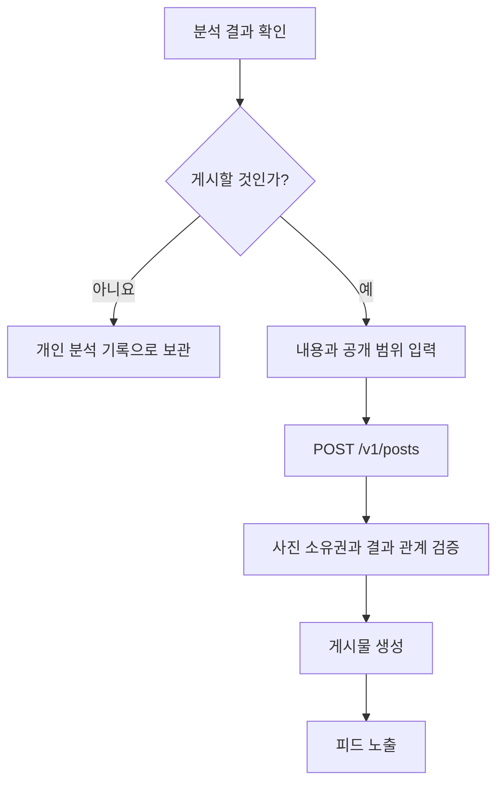

# 01. 시스템 구조 및 워크플로우

## 1. 전체 구성



> Notion에서 Mermaid가 렌더링되지 않으면 `/code` 블록을 만들고 언어를 `Mermaid`로 선택한 뒤 위 내용을 붙여넣는다.

### 구조 요약

1. Flutter는 FastAPI에만 요청한다.
2. FastAPI는 인증, 권한 검사, DB 저장 및 작업 생성을 담당한다.
3. 이미지 원본은 Object Storage에 저장한다.
4. AI 분석은 Redis/Celery를 통해 PyTorch Worker가 비동기로 실행한다.
5. 분석 완료 후 DB에 결과를 저장하고 Flutter에 푸시 알림을 보낸다.

---

## 2. 파트별 책임

| 파트 | 담당 범위 | 담당하지 않는 것 |
|---|---|---|
| Flutter | 화면, 사진 선택, API 호출, 상태 표시, 푸시 수신 | AI 직접 호출, DB 직접 접근 |
| Backend | 인증, 권한, API, 데이터, 파일, 작업 및 알림 관리 | 모델 내부 전처리 규칙 결정 |
| AI | 전처리, PyTorch 추론, 후처리, 모델 버전 관리 | 사용자 인증, 게시물 생성 |
| PostgreSQL | 사용자·사진 메타데이터·결과·게시물 저장 | 원본 이미지 저장 |
| Object Storage | 원본 및 썸네일 저장 | 데이터 관계와 권한 관리 |

> ✅ **경계 원칙:** Flutter와 AI 파트는 서로 직접 통신하지 않는다. Backend가 데이터와 상태의 단일 진실 공급원 역할을 한다.

---

## 3. 사진 분석 워크플로우



## 4. 작업 상태

```text
PENDING → PROCESSING → COMPLETED
                   └→ FAILED → PENDING(재시도)

PENDING → CANCELED
```

| 상태 | 의미 | Flutter 표시 예시 |
|---|---|---|
| `PENDING` | 큐에서 실행 대기 중 | 분석을 준비하고 있어요 |
| `PROCESSING` | AI가 분석 중 | 사진을 분석하고 있어요 |
| `COMPLETED` | 결과 저장 완료 | 분석이 완료되었어요 |
| `FAILED` | 분석 실패 | 분석하지 못했어요 |
| `CANCELED` | 사용자 또는 시스템 취소 | 분석이 취소되었어요 |

---

## 5. 분석 후 게시 흐름



> 분석 완료와 게시물 공개는 별개의 사용자 행동이다. 분석 결과가 생성되어도 자동으로 공개하지 않는다.

