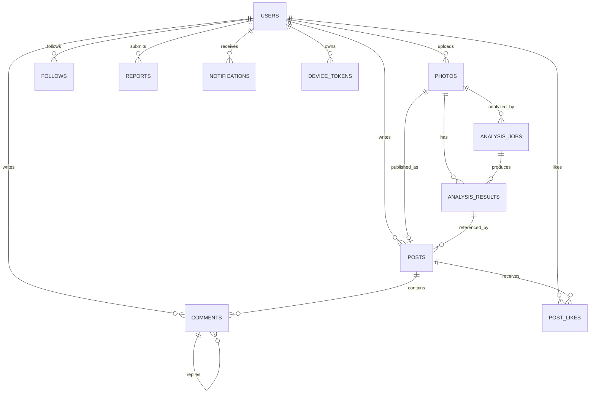

# 02. DB 스키마

## 1. 설계 원칙

- 기본키는 `UUID`를 사용한다.
- 날짜는 `TIMESTAMPTZ`로 저장하고 서버·DB 내부 기준은 UTC로 통일한다.
- 테이블과 컬럼 이름은 `snake_case`를 사용한다.
- 이미지 바이너리는 DB가 아니라 Object Storage에 저장한다.
- DB에는 만료되는 URL 대신 `storage_key`를 저장한다.
- AI 결과에는 `model_name`과 `model_version`을 반드시 저장한다.
- 검색·정렬·통계에 사용하는 값은 일반 컬럼으로 저장한다.
- 모델별 가변 데이터만 `JSONB`로 저장한다.
- 운영 이력이 필요한 데이터는 소프트 삭제를 적용한다.

---

## 2. ERD



---

## 3. `users`

사용자 계정과 프로필을 저장한다.

| 컬럼 | 타입 | Null | 제약조건 | 설명 |
|---|---|---:|---|---|
| `id` | UUID | N | PK | 사용자 ID |
| `email` | VARCHAR(255) | N | UNIQUE | 로그인 이메일 |
| `password_hash` | VARCHAR(255) | Y |  | 암호화된 비밀번호 |
| `nickname` | VARCHAR(30) | N | UNIQUE | 닉네임 |
| `profile_image_key` | VARCHAR(500) | Y |  | 프로필 이미지 키 |
| `provider` | VARCHAR(20) | N |  | LOCAL, KAKAO, GOOGLE |
| `provider_id` | VARCHAR(255) | Y |  | 소셜 사용자 식별자 |
| `status` | VARCHAR(20) | N | DEFAULT ACTIVE | 계정 상태 |
| `created_at` | TIMESTAMPTZ | N |  | 가입 시각 |
| `updated_at` | TIMESTAMPTZ | N |  | 수정 시각 |
| `deleted_at` | TIMESTAMPTZ | Y |  | 탈퇴 시각 |

**인덱스**

```sql
UNIQUE (email)
UNIQUE (nickname)
UNIQUE (provider, provider_id)
INDEX (status)
```

---

## 4. `photos`

사진 원본이 아니라 저장 위치와 메타데이터를 저장한다.

| 컬럼 | 타입 | Null | 제약조건 | 설명 |
|---|---|---:|---|---|
| `id` | UUID | N | PK | 사진 ID |
| `user_id` | UUID | N | FK → users.id | 소유자 |
| `original_storage_key` | VARCHAR(500) | N | UNIQUE | 원본 저장 키 |
| `thumbnail_storage_key` | VARCHAR(500) | Y |  | 썸네일 저장 키 |
| `content_type` | VARCHAR(100) | N |  | MIME 타입 |
| `file_size` | BIGINT | N | CHECK > 0 | 파일 크기 |
| `width` | INTEGER | Y |  | 이미지 너비 |
| `height` | INTEGER | Y |  | 이미지 높이 |
| `checksum` | VARCHAR(64) | Y |  | 중복·무결성 확인값 |
| `status` | VARCHAR(20) | N | DEFAULT UPLOADED | 상태 |
| `taken_at` | TIMESTAMPTZ | Y |  | 촬영 시각 |
| `created_at` | TIMESTAMPTZ | N |  | 업로드 시각 |
| `deleted_at` | TIMESTAMPTZ | Y |  | 삭제 시각 |

**인덱스**

```sql
INDEX (user_id, created_at DESC)
INDEX (status)
```

---

## 5. `analysis_jobs`

AI 작업의 실행 상태와 오류를 저장한다.

| 컬럼 | 타입 | Null | 제약조건 | 설명 |
|---|---|---:|---|---|
| `id` | UUID | N | PK | 작업 ID |
| `photo_id` | UUID | N | FK → photos.id | 분석 사진 |
| `requested_by` | UUID | N | FK → users.id | 요청 사용자 |
| `status` | VARCHAR(20) | N | DEFAULT PENDING | 작업 상태 |
| `attempt_count` | INTEGER | N | DEFAULT 0 | 실행 횟수 |
| `error_code` | VARCHAR(50) | Y |  | 공개 가능한 오류 코드 |
| `error_message` | TEXT | Y |  | 내부 오류 내용 |
| `requested_at` | TIMESTAMPTZ | N |  | 요청 시각 |
| `started_at` | TIMESTAMPTZ | Y |  | 시작 시각 |
| `completed_at` | TIMESTAMPTZ | Y |  | 완료 시각 |

**인덱스**

```sql
INDEX (photo_id)
INDEX (status, requested_at)
```

---

## 6. `analysis_results`

모델의 분석 결과를 버전별로 저장한다.

| 컬럼 | 타입 | Null | 제약조건 | 설명 |
|---|---|---:|---|---|
| `id` | UUID | N | PK | 분석 결과 ID |
| `job_id` | UUID | N | FK, UNIQUE | 작업 ID |
| `photo_id` | UUID | N | FK → photos.id | 사진 ID |
| `primary_emotion` | VARCHAR(30) | N |  | 대표 감정 |
| `confidence` | NUMERIC(5,4) | N | CHECK 0~1 | 신뢰도 |
| `emotion_scores` | JSONB | N |  | 전체 감정별 점수 |
| `feature_data` | JSONB | Y |  | 모델별 부가 결과 |
| `model_name` | VARCHAR(100) | N |  | 모델 이름 |
| `model_version` | VARCHAR(50) | N |  | 모델 버전 |
| `processing_time_ms` | INTEGER | Y | CHECK >= 0 | 처리 시간 |
| `created_at` | TIMESTAMPTZ | N |  | 생성 시각 |

**결과 예시**

```json
{
  "CALM": 0.82,
  "JOY": 0.11,
  "SADNESS": 0.07
}
```

**인덱스**

```sql
UNIQUE (job_id)
INDEX (photo_id, created_at DESC)
INDEX (primary_emotion)
INDEX (model_name, model_version)
```

---

## 7. `posts`

| 컬럼 | 타입 | Null | 제약조건 | 설명 |
|---|---|---:|---|---|
| `id` | UUID | N | PK | 게시물 ID |
| `user_id` | UUID | N | FK → users.id | 작성자 |
| `photo_id` | UUID | N | FK → photos.id | 사진 |
| `analysis_result_id` | UUID | Y | FK → analysis_results.id | 표시할 분석 결과 |
| `content` | TEXT | Y |  | 본문 |
| `visibility` | VARCHAR(20) | N | DEFAULT PUBLIC | 공개 범위 |
| `status` | VARCHAR(20) | N | DEFAULT ACTIVE | 상태 |
| `created_at` | TIMESTAMPTZ | N |  | 작성 시각 |
| `updated_at` | TIMESTAMPTZ | N |  | 수정 시각 |
| `deleted_at` | TIMESTAMPTZ | Y |  | 삭제 시각 |

**인덱스**

```sql
INDEX (status, visibility, created_at DESC)
INDEX (user_id, created_at DESC)
```

---

## 8. 커뮤니티·알림 테이블 요약

### `comments`

| 핵심 컬럼 | 설명 |
|---|---|
| `id` | 댓글 ID |
| `post_id` | 대상 게시물 |
| `user_id` | 작성자 |
| `parent_id` | 부모 댓글, 대댓글이 아니면 NULL |
| `content` | 내용 |
| `status`, `deleted_at` | 삭제·차단 관리 |

### `post_likes`

| 핵심 컬럼 | 설명 |
|---|---|
| `post_id` | 게시물 ID, 복합 PK |
| `user_id` | 사용자 ID, 복합 PK |
| `created_at` | 좋아요 시각 |

### `follows`

| 핵심 컬럼 | 설명 |
|---|---|
| `follower_id` | 팔로우하는 사용자, 복합 PK |
| `following_id` | 팔로우 대상, 복합 PK |
| `status` | 관계 상태 |

`CHECK (follower_id <> following_id)`를 적용한다.

### `reports`

| 핵심 컬럼 | 설명 |
|---|---|
| `reporter_id` | 신고자 |
| `target_type` | POST, COMMENT, USER |
| `target_id` | 대상 ID |
| `reason_code` | 신고 사유 |
| `status` | 처리 상태 |

### `notifications`

| 핵심 컬럼 | 설명 |
|---|---|
| `user_id` | 수신자 |
| `actor_id` | 행동 사용자 |
| `type` | ANALYSIS_COMPLETED, LIKE, COMMENT, FOLLOW |
| `target_type`, `target_id` | 이동 대상 |
| `payload` | 표시용 부가 데이터 |
| `read_at` | 읽음 시각 |

### `device_tokens`

| 핵심 컬럼 | 설명 |
|---|---|
| `user_id` | 사용자 |
| `token` | FCM 토큰, UNIQUE |
| `platform` | IOS, ANDROID |
| `last_used_at` | 마지막 사용 시각 |

---

## 9. 데이터 관계 규칙

- 게시물 작성자는 해당 사진의 소유자여야 한다.
- `analysis_result_id`는 해당 게시물의 `photo_id`에서 생성된 결과여야 한다.
- 분석 작업 요청자는 사진 소유자여야 한다.
- 삭제된 사진에 새로운 분석을 요청할 수 없다.
- 게시물 삭제가 사진 원본 삭제를 의미하지 않는다.
- 같은 사용자는 같은 게시물에 좋아요를 한 번만 등록할 수 있다.

